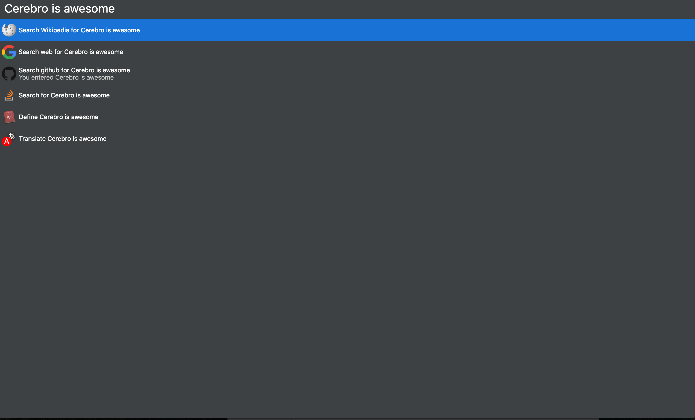

# cerebro-wiki

> [Cerebro](https://cerebroapp.com) plugin to use DuckDuckGo as a search engine

## Usage

In Cerebro, type any term, and the Wikipedia search option will show:

## TODO

- Preview Results as [Cerebro's native Google Plugin](https://github.com/KELiON/cerebro/blob/master/app/main/plugins/core/google/index.js)

## License

MIT © [Tiago Amaro](http://tiagoamaro.com.br)
